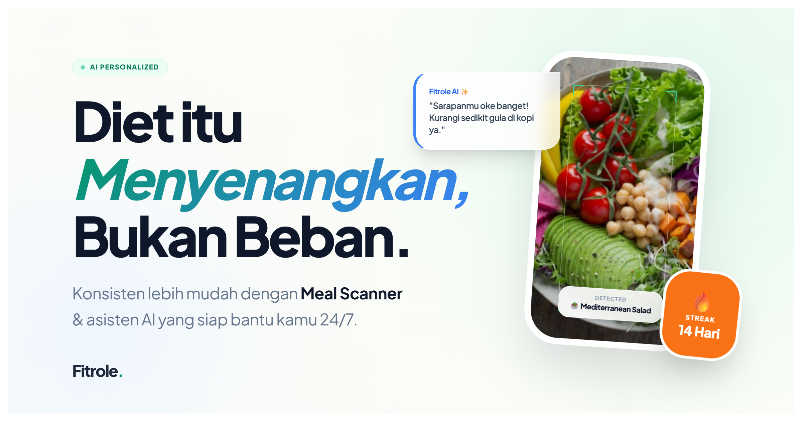

# Fitrole: Sistem Informasi Pemantauan Diet Sehat



Fitrole adalah platform manajemen kesehatan modern yang dirancang untuk membantu pengguna melacak nutrisi, berat badan, dan kebiasaan sehat secara konsisten. Dibangun dengan **Laravel 12** dan diintegrasikan dengan **Google Gemini AI** untuk analisis nutrisi berbasis visi yang cerdas.

---

## ✨ Fitur Unggulan

* **📊 Interactive Dashboard**: Visualisasi ringkasan aktivitas kesehatan harian dengan antarmuka yang bersih dan informatif menggunakan Chart.js.
* **📈 Tracking Progres**: Pantau perubahan berat badan dan tren nutrisi secara berkala untuk memastikan kamu tetap berada pada jalur *body goals*.
* **💬 AI Chatbot**: Asisten cerdas bertenaga Gemini AI yang siap menjawab pertanyaan seputar kesehatan dan memberikan saran nutrisi secara personal.
* **📸 AI Meal Scanner**: Lacak asupan harian hanya dengan mengambil foto. AI akan mendeteksi nama makanan serta menghitung kalori, protein, karbohidrat, dan lemak secara instan.
* **🏆 Gamification & Badges**: Dapatkan penghargaan (Achievement) secara real-time melalui sistem multi-badge yang memotivasi kamu untuk tetap hidup sehat.

## 🚀 Teknologi Utama

- **Framework**: [Laravel 12](https://laravel.com)
- **AI Engine**: [Google Gemini 2.5 Flash](https://ai.google.dev/)
- **Frontend**: [Tailwind CSS](https://tailwindcss.com) & [Alpine.js](https://alpinejs.dev)
- **Charts**: [Chart.js](https://www.chartjs.org/)
- **Database**: MySQL

## 📦 Panduan Instalasi

Ikuti langkah berikut untuk menjalankan Fitrole di komputer lokal Anda:

### 1. Persiapan Awal
```bash
# Clone repositori
git clone https://github.com/SatriaDharma/Fitrole.git
cd fitrole

# Instal dependensi PHP
composer install

# Instal dependensi Frontend
npm install && npm run dev

```

### 2. Konfigurasi Environment

Salin file `.env.example` menjadi `.env` dan sesuaikan pengaturan database Anda.

```bash
cp .env.example .env
php artisan key:generate

```

### 3. Integrasi AI Gemini

Dapatkan API Key di [Google AI Studio](https://aistudio.google.com/) dan masukkan ke `.env`:

```env
GEMINI_KEY=isi_api_key_anda_disini

```

### 4. Database & Storage

```bash
# Jalankan migrasi dan isi data awal (Badges Seeder)
php artisan migrate --seed

# Hubungkan folder storage
php artisan storage:link

```

### 5. Jalankan Aplikasi

```bash
php artisan serve

```
